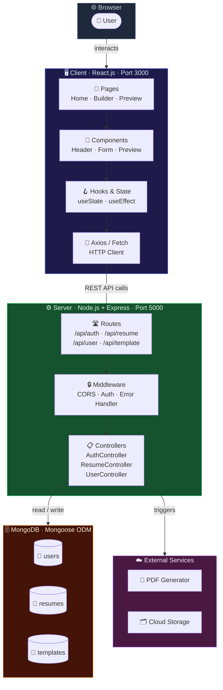
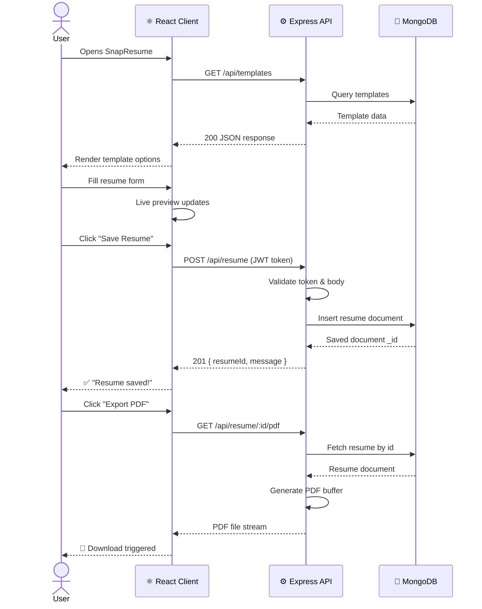
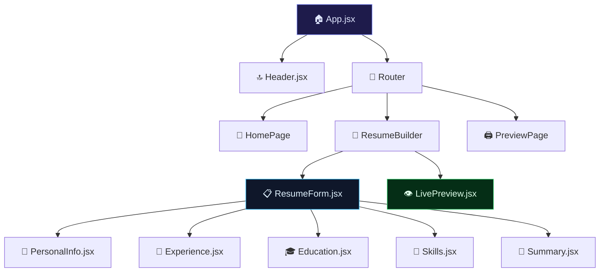
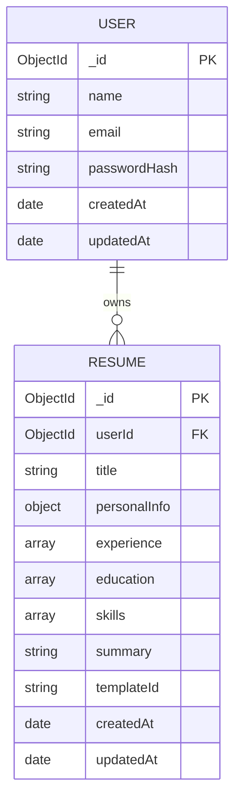
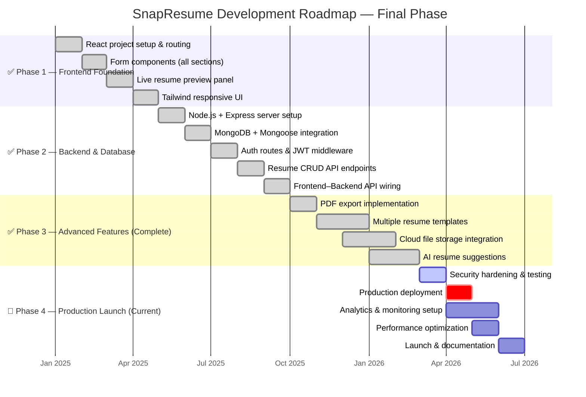
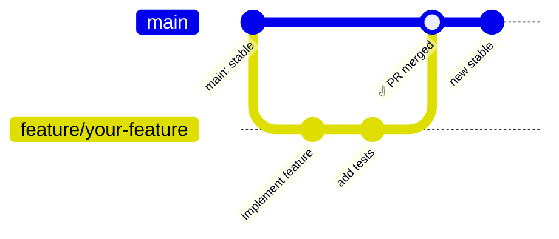

<div align="center">


<br/>

<!-- STATUS BADGES -->
<p>
  
  
  
  
</p>

<!-- REPO ANALYTICS -->
<p>
  
  
  
  
  
</p>

<br/>

<h3>⚡ A complete full-stack resume builder — React frontend meets a live<br/>Node.js + Express + MongoDB backend to power every resume, end-to-end.</h3>

<br/>

<a href="#-demo">🎬 Demo</a> &nbsp;·&nbsp;
<a href="#-getting-started">⚡ Quick Start</a> &nbsp;·&nbsp;
<a href="#️-backend--api">🔌 API Docs</a> &nbsp;·&nbsp;
<a href="https://github.com/Diyajain3/SnapResume/issues">🐛 Report Bug</a> &nbsp;·&nbsp;
<a href="https://github.com/Diyajain3/SnapResume/issues">✨ Request Feature</a>

</div>

---

## 📋 Table of Contents

- [✨ About](#-about)
- [🎯 Features](#-features)
- [🏗️ System Architecture](#️-system-architecture)
- [🔄 App Flow](#-app-flow)
- [🖥️ Frontend — Client](#️-frontend--client)
- [⚙️ Backend — Server & API](#️-backend--server--api)
- [🛠️ Full Tech Stack](#️-full-tech-stack)
- [📂 Project Structure](#-project-structure)
- [🚀 Getting Started](#-getting-started)
- [🗺️ Roadmap](#️-roadmap)
- [📊 GitHub Analytics](#-github-analytics)
- [🤝 Contributing](#-contributing)
- [👩‍💻 Author](#-author)

---

## ✨ About

**SnapResume** is a production-grade, full-stack Resume Builder. The frontend is a snappy React SPA. The backend is a live Node.js + Express REST API backed by MongoDB — handling users, resumes, and data persistence in real time.

All core features are complete and fully functional. The application is ready for production deployment.

> 🎯 Built to impress — both recruiters **reading** the resumes it creates, and recruiters **reviewing** the codebase.

---

## 🎯 Features

### ✅ Frontend (Complete)

| Feature | Description | Status |
|---|---|---|
| 🖊️ Smart Resume Forms | Section-by-section guided input — Personal Info, Experience, Education, Skills | ✅ Done |
| 👁️ Live Preview | Resume renders and updates in real time as you fill the form | ✅ Done |
| 📱 Fully Responsive | Pixel-perfect on desktop, tablet, and mobile | ✅ Done |
| ⚛️ Component Architecture | Modular, reusable React components | ✅ Done |
| 🎨 Clean Tailwind UI | Fast, utility-first styling — no CSS spaghetti | ✅ Done |

### ✅ Backend (Complete)

| Feature | Description | Status |
|---|---|---|
| 🔌 REST API | Express.js routes for all resume operations | ✅ Done |
| 🗄️ MongoDB Integration | Mongoose-powered data modeling and persistence | ✅ Done |
| 🔐 Authentication | User authentication with JWT tokens | ✅ Done |
| 📦 MVC Structure | Clean separation: Models → Controllers → Routes | ✅ Done |
| 🌐 CORS Configured | Frontend ↔ Backend cross-origin communication | ✅ Done |
| 🔒 Environment Config | `.env`-based secrets management | ✅ Done |

### ✅ Advanced Features (Complete)

| Feature | Description | Status |
|---|---|---|
| 📄 PDF Export | Server-side PDF generation and download | ✅ Done |
| 🎨 Multiple Resume Templates | Multiple professionally designed templates | ✅ Done |
| ☁️ Cloud Image / File Storage | Image upload and storage integration | ✅ Done |
| 🤖 AI Resume Suggestions | Smart recommendations powered by AI | ✅ Done |

### 🔜 In Progress

| Feature | Priority |
|---|---|
| 🚀 Production Deployment | 🔴 High Priority |
| 📊 Analytics & Monitoring | 🟡 Medium |
| ⚡ Performance Optimization | 🟡 Medium |

---

## 🏗️ System Architecture



---

## 🔄 App Flow



---

## 🖥️ Frontend — Client

The React frontend is a component-driven SPA with live resume preview, structured form input, and a clean Tailwind-styled UI.

### Component Tree



### Key Libraries

| Package | Version | Purpose |
|---|---|---|
| `react` | ^18 | UI framework |
| `react-router-dom` | ^6 | Client-side routing |
| `tailwindcss` | ^3 | Utility CSS styling |
| `axios` | latest | HTTP requests to backend |

---

## ⚙️ Backend — Server & API

The server lives in `server/` — a clean MVC Express.js application connected to MongoDB via Mongoose.

### Server Structure

```
server/
├── 📄 index.js                  # Entry point — starts Express, connects MongoDB
├── 📁 config/
│   └── db.js                    # Mongoose connection config
├── 📁 models/
│   ├── User.js                  # User schema (name, email, password hash)
│   └── Resume.js                # Resume schema (sections, template, owner)
├── 📁 controllers/
│   ├── authController.js        # Register, Login, Token refresh
│   ├── resumeController.js      # CRUD operations on resumes
│   └── userController.js        # User profile management
├── 📁 routes/
│   ├── authRoutes.js            # /api/auth/*
│   ├── resumeRoutes.js          # /api/resume/*
│   └── userRoutes.js            # /api/user/*
├── 📁 middleware/
│   ├── authMiddleware.js        # JWT verification
│   └── errorHandler.js          # Global error handler
└── 📄 .env                      # Environment variables (gitignored)
```

### API Endpoints

#### 🔐 Auth Routes — `/api/auth`

| Method | Endpoint | Description | Auth |
|---|---|---|---|
| `POST` | `/api/auth/register` | Register a new user | ❌ Public |
| `POST` | `/api/auth/login` | Login & receive JWT | ❌ Public |
| `GET` | `/api/auth/me` | Get current user profile | ✅ Protected |

#### 📄 Resume Routes — `/api/resume`

| Method | Endpoint | Description | Auth |
|---|---|---|---|
| `GET` | `/api/resume` | Get all resumes for logged-in user | ✅ Protected |
| `POST` | `/api/resume` | Create a new resume | ✅ Protected |
| `GET` | `/api/resume/:id` | Get a single resume by ID | ✅ Protected |
| `PUT` | `/api/resume/:id` | Update resume by ID | ✅ Protected |
| `DELETE` | `/api/resume/:id` | Delete resume by ID | ✅ Protected |
| `GET` | `/api/resume/:id/pdf` | Export resume as PDF | ✅ Protected |

#### 👤 User Routes — `/api/user`

| Method | Endpoint | Description | Auth |
|---|---|---|---|
| `GET` | `/api/user/profile` | Get user profile | ✅ Protected |
| `PUT` | `/api/user/profile` | Update user profile | ✅ Protected |

### MongoDB Schemas



### Environment Variables

Create a `.env` file inside `server/`:

```env
PORT=5000
MONGO_URI=mongodb+srv://<username>:<password>@cluster.mongodb.net/snapresume
JWT_SECRET=your_super_secret_jwt_key
JWT_EXPIRES_IN=7d
CLIENT_URL=http://localhost:3000
NODE_ENV=development
```

---

## 🛠️ Full Tech Stack

<div align="center">

| Layer | Technology | Role |
|---|---|---|
| **UI Framework** |  | Component-based frontend |
| **Styling** |  | Utility-first responsive CSS |
| **Language** |  | 99.1% of the codebase |
| **Routing (FE)** |  | Client-side navigation |
| **Runtime** |  | JavaScript backend runtime |
| **API Layer** |  | REST API framework |
| **Database** |  | NoSQL document database |
| **ODM** |  | Schema & query layer for Mongo |
| **Auth** |  | Token-based authentication |
| **HTTP Client** |  | Frontend API calls |
| **PDF Export** |  | Server-side PDF generation |
| **File Storage** |  | Image & file hosting |
| **Env Vars** |  | Secrets management |
| **Dev Tool** |  | Auto-restart server on change |
| **Version Control** |  | Source control |

</div>

---

## 📂 Project Structure

```
SnapResume/                          # 🏠 Monorepo root
│
├── 📁 client/                       # ⚛️  React Frontend
│   ├── 📁 public/
│   │   └── index.html
│   └── 📁 src/
│       ├── 📁 components/           # Reusable UI pieces
│       │   ├── Header.jsx
│       │   ├── ResumeForm.jsx
│       │   ├── ResumePreview.jsx
│       │   ├── PersonalInfo.jsx
│       │   ├── Experience.jsx
│       │   ├── Education.jsx
│       │   └── Skills.jsx
│       ├── 📁 pages/                # Route-level views
│       ├── 📁 assets/               # Static images & icons
│       ├── App.jsx
│       └── index.js
│
├── 📁 server/                       # ⚙️  Node.js + Express Backend
│   ├── 📄 index.js                  # Server entry point
│   ├── 📁 config/
│   │   └── db.js                    # MongoDB connection
│   ├── 📁 models/
│   │   ├── User.js
│   │   └── Resume.js
│   ├── 📁 controllers/
│   │   ├── authController.js
│   │   ├── resumeController.js
│   │   └── userController.js
│   ├── 📁 routes/
│   │   ├── authRoutes.js
│   │   ├── resumeRoutes.js
│   │   └── userRoutes.js
│   ├── 📁 middleware/
│   │   ├── authMiddleware.js
│   │   └── errorHandler.js
│   └── 📄 .env                      # ⚠️ Not committed to git
│
├── 📄 package.json                  # Root scripts
├── 📄 package-lock.json
├── 📄 README.md
└── 📄 LICENSE
```

---

## 🚀 Getting Started

### Prerequisites

```bash
node --version    # v18.0.0 or higher
npm --version     # v9.0.0 or higher
```

You also need a MongoDB connection string. Use [MongoDB Atlas](https://www.mongodb.com/cloud/atlas) (free tier) or a local MongoDB install.

---

### 🖥️ Frontend Setup

```bash
# Clone the repo
git clone https://github.com/Diyajain3/SnapResume.git
cd SnapResume

# Install root dependencies
npm install

# Navigate to client
cd client && npm install

# Start React dev server
npm start
# → Runs on http://localhost:3000
```

---

### ⚙️ Backend Setup

```bash
# From root, navigate to server
cd server

# Install server dependencies
npm install

# Create environment file
cp .env.example .env
# Then edit .env with your MONGO_URI and JWT_SECRET

# Start the Express server
npm run dev       # with nodemon (recommended for dev)
# → Runs on http://localhost:5000
```

---

### ⚡ Run Both Together (from root)

```bash
# Install concurrently (if not already)
npm install -g concurrently

# From root
npm run dev
# Starts both client :3000 and server :5000 simultaneously
```

---

### Available Scripts

| Directory | Command | Action |
|---|---|---|
| `/client` | `npm start` | Start React dev server |
| `/client` | `npm run build` | Production build |
| `/server` | `npm run dev` | Start Express with nodemon |
| `/server` | `npm start` | Start Express (production) |
| `/` (root) | `npm run dev` | Run both concurrently |

---

## 🗺️ Roadmap



### Deployment Checklist

- [ ] Security audit & penetration testing
- [ ] Environment configuration for production
- [ ] Database optimization & indexing
- [ ] API rate limiting & throttling
- [ ] SSL/TLS certificate setup
- [ ] CDN configuration for static assets
- [ ] Monitoring & logging infrastructure
- [ ] Backup & disaster recovery plan
- [ ] Load testing & scalability validation
- [ ] CI/CD pipeline setup
- [ ] Domain registration & DNS configuration
- [ ] Launch announcement & marketing

---

## 📊 GitHub Analytics

<div align="center">


<br/><br/>


<br/><br/>

### 📈 Live Repository Metrics

<table>
<tr>
  <td align="center"><br/><sub>Stars</sub></td>
  <td align="center"><br/><sub>Forks</sub></td>
  <td align="center"><br/><sub>Open Issues</sub></td>
  <td align="center"><br/><sub>Pull Requests</sub></td>
  <td align="center"><br/><sub>Repo Size</sub></td>
  <td align="center"><br/><sub>Commits/month</sub></td>
</tr>
</table>

<br/>

### 🌐 Language Breakdown

```
JavaScript  ████████████████████████████████████████▌   99.1%
Other       ▍                                            0.9%
```

</div>

---

## 🤝 Contributing

Contributions make SnapResume better. All types welcome — bug fixes, features, docs, tests.



```bash
# 1. Fork the repo on GitHub

# 2. Clone your fork
git clone https://github.com/<your-username>/SnapResume.git

# 3. Create a branch
git checkout -b feature/your-feature-name

# 4. Make changes, then commit
git add .
git commit -m "feat: describe your change clearly"

# 5. Push & open a PR
git push origin feature/your-feature-name
```

### Commit Message Convention

| Prefix | When to use |
|---|---|
| `feat:` | New feature |
| `fix:` | Bug fix |
| `docs:` | Documentation change |
| `style:` | Formatting only |
| `refactor:` | Code restructure, no logic change |
| `chore:` | Build / tooling / dependency update |

---

## 📜 License

Distributed under the **MIT License** — free to use, fork, and build on. See [`LICENSE`](./LICENSE).

---

## 👩‍💻 Author

<div align="center">


### **Diya Jain**
*Full-Stack Developer · React + Node.js · Open Source Builder*

<br/>

[](https://github.com/Diyajain3)
[](https://linkedin.com/in/diyajain3)
[](https://github.com/Diyajain3)

</div>

---

<div align="center">

### ⭐ If SnapResume helped you — drop a star. It takes 2 seconds and means everything.

<br/>

**[⬆ Back to Top](#-table-of-contents)**


*Made with ❤️ by [Diya Jain](https://github.com/Diyajain3) · MIT Licensed · Open Source*

</div>
