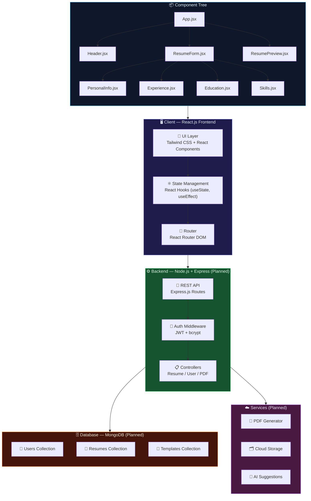
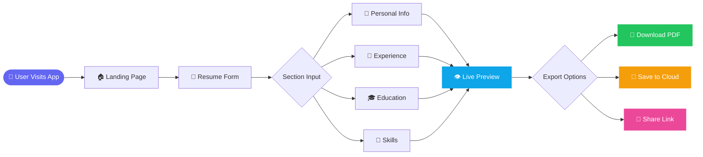
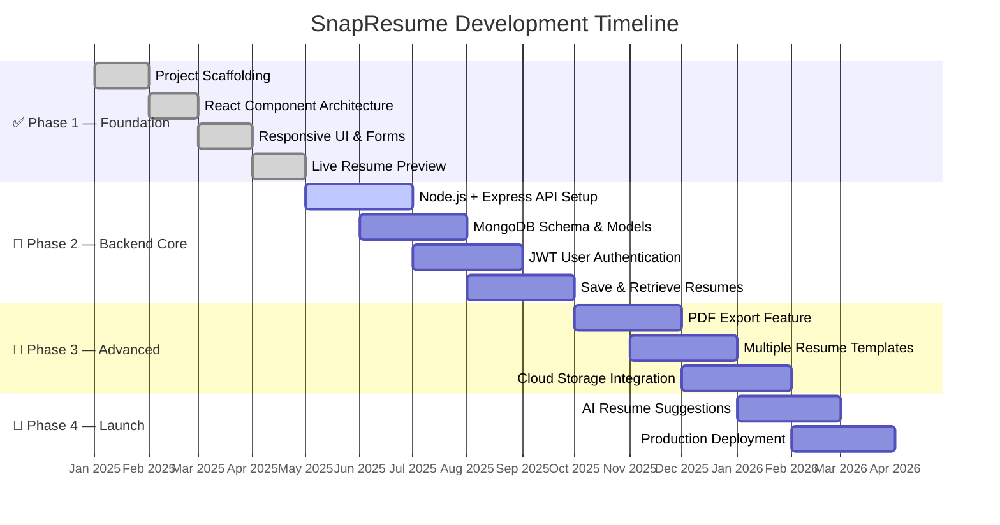
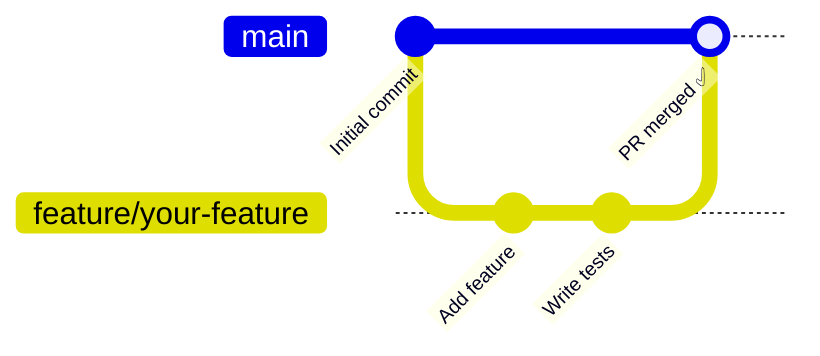

<div align="center">


<br/>

<!-- STATUS BADGES -->
<p>
  
  
  
  
  
</p>

<!-- TECH BADGES -->
<p>
  
  
  
  
  
</p>

<!-- ANALYTICS BADGES -->
<p>
  
  
  
</p>

<br/>

<h3>
  ⚡ A sleek, full-stack resume builder that helps job seekers craft<br/>
  ATS-friendly, recruiter-approved resumes — in seconds, not hours.
</h3>

<br/>

<a href="#-demo">View Demo</a> · <a href="#-getting-started">Quick Start</a> · <a href="https://github.com/Diyajain3/SnapResume/issues">Report Bug</a> · <a href="https://github.com/Diyajain3/SnapResume/issues">Request Feature</a>

</div>

---

## 📋 Table of Contents

- [✨ About](#-about)
- [🎯 Features](#-features)
- [🏗️ Architecture](#️-architecture)
- [🔄 App Flow](#-app-flow)
- [🛠️ Tech Stack](#️-tech-stack)
- [📂 Project Structure](#-project-structure)
- [🚀 Getting Started](#-getting-started)
- [🗺️ Roadmap](#️-roadmap)
- [📊 GitHub Analytics](#-github-analytics)
- [🤝 Contributing](#-contributing)
- [👩‍💻 Author](#-author)

---

## ✨ About

**SnapResume** is a modern, full-stack Resume Builder application that removes every friction point between a job seeker and their perfect resume.

Whether you're a fresh graduate landing your first role or an experienced professional pivoting industries — SnapResume gives you:

- 🧩 **Guided, form-based input** for every resume section
- 👁️ **Real-time live preview** — see changes as you type
- 🎯 **ATS-optimized layouts** that pass automated screening
- 📱 **Fully responsive** — works beautifully on every device
- ⚡ **Zero friction** — no account needed to get started

> 💡 **Why SnapResume?** Most resume builders are bloated, slow, or lock key features behind paywalls. SnapResume is built developer-first — fast, open, and extensible.

---

## 🎯 Features

### ✅ Currently Live

| Feature | Description | Status |
|---|---|---|
| 🖊️ Smart Resume Forms | Structured input for all sections — personal, experience, education, skills | ✅ Live |
| 👁️ Live Preview | Resume updates instantly as you type | ✅ Live |
| ⚛️ Component Architecture | Modular, reusable React components | ✅ Live |
| 📱 Responsive Design | Pixel-perfect on desktop, tablet, and mobile | ✅ Live |
| 🎨 Clean Modern UI | Tailwind CSS powered, distraction-free interface | ✅ Live |

### 🔜 Upcoming Features

| Feature | Version | Priority |
|---|---|---|
| 🔐 JWT User Authentication | v2.0 | 🔴 High |
| 💾 Save & Manage Resumes | v2.0 | 🔴 High |
| 📄 Export to PDF | v2.1 | 🔴 High |
| 🎨 Multiple Resume Templates | v2.2 | 🟡 Medium |
| ☁️ Cloud Storage | v3.0 | 🟡 Medium |
| 🤖 AI-Powered Suggestions | v3.0 | 🟢 Future |
| 🌐 Deployed Production App | v3.1 | 🟢 Future |

---

## 🏗️ Architecture



---

## 🔄 App Flow



---

## 🛠️ Tech Stack

<div align="center">

| Layer | Technology | Purpose |
|---|---|---|
| **Frontend Framework** |  | UI rendering & component architecture |
| **Styling** |  | Utility-first responsive styling |
| **Language** |  | 99.1% of codebase |
| **Runtime** |  | Backend server *(planned)* |
| **API Layer** |  | REST API routes *(planned)* |
| **Database** |  | NoSQL data persistence *(planned)* |
| **Auth** |  | Secure token auth *(planned)* |
| **Package Manager** |  | Dependency management |
| **Version Control** |  | Source control |

</div>

---

## 📂 Project Structure

```
SnapResume/
│
├── 📁 client/                        # ⚛️  React Frontend Application
│   ├── 📁 public/                    # Static public assets
│   │   └── index.html
│   └── 📁 src/
│       ├── 📁 components/            # 🧩 Reusable UI Components
│       │   ├── Header.jsx            #    App header & navigation
│       │   ├── ResumeForm.jsx        #    Master form wrapper
│       │   ├── ResumePreview.jsx     #    Live resume preview panel
│       │   ├── PersonalInfo.jsx      #    Personal details section
│       │   ├── Experience.jsx        #    Work experience section
│       │   ├── Education.jsx         #    Education section
│       │   └── Skills.jsx            #    Skills & technologies section
│       ├── 📁 pages/                 # 📄 Route-level page components
│       ├── 📁 assets/                # 🖼️  Images, fonts, icons
│       ├── App.jsx                   # 🏠 Root application component
│       └── index.js                  # 🔑 Entry point
│
├── 📁 node_modules/                  # 📦 Dependencies (auto-generated)
├── 📄 package.json                   # Project manifest & scripts
├── 📄 package-lock.json              # Locked dependency tree
├── 📄 README.md                      # Project documentation
└── 📄 LICENSE                        # MIT License
```

---

## 🚀 Getting Started

### Prerequisites

```bash
node --version    # v18.0.0 or higher
npm --version     # v9.0.0 or higher
```

### Installation & Setup

```bash
# 1. Clone the repository
git clone https://github.com/Diyajain3/SnapResume.git

# 2. Navigate to the project root
cd SnapResume

# 3. Install root dependencies
npm install

# 4. Navigate to the client
cd client

# 5. Install client dependencies
npm install

# 6. Start the development server
npm start
```

🎉 App will be running at **`http://localhost:3000`**

### Available Scripts

| Command | Description |
|---|---|
| `npm start` | Start development server |
| `npm run build` | Build for production |
| `npm test` | Run test suite |

---

## 🗺️ Roadmap



---

## 📊 GitHub Analytics

<div align="center">


<br/><br/>


<br/><br/>

### 📈 Repository Stats At a Glance

<table>
  <tr>
    <td align="center">
      
      <br/><sub><b>Stars</b></sub>
    </td>
    <td align="center">
      
      <br/><sub><b>Forks</b></sub>
    </td>
    <td align="center">
      
      <br/><sub><b>Open Issues</b></sub>
    </td>
    <td align="center">
      
      <br/><sub><b>Pull Requests</b></sub>
    </td>
    <td align="center">
      
      <br/><sub><b>Repo Size</b></sub>
    </td>
    <td align="center">
      
      <br/><sub><b>Monthly Commits</b></sub>
    </td>
  </tr>
</table>

<br/>

### 🌐 Language Distribution

```
JavaScript  ████████████████████████████████████████  99.1%
Other       ▌                                          0.9%
```

</div>

---

## 🤝 Contributing

Contributions make this project better! Every bug fix, feature, and improvement is welcome.



### Steps to Contribute

```bash
# 1. Fork the repository on GitHub

# 2. Clone your fork
git clone https://github.com/<your-username>/SnapResume.git

# 3. Create a feature branch
git checkout -b feature/amazing-feature

# 4. Make your changes and commit
git add .
git commit -m "feat: add amazing feature"

# 5. Push to your fork
git push origin feature/amazing-feature

# 6. Open a Pull Request on GitHub 🎉
```

### Commit Convention

| Prefix | Use For |
|---|---|
| `feat:` | New feature |
| `fix:` | Bug fix |
| `docs:` | Documentation update |
| `style:` | Code formatting |
| `refactor:` | Code restructuring |
| `chore:` | Maintenance tasks |

---

## 👩‍💻 Author

<div align="center">


### **Diya Jain**
*Full-Stack Developer · React Enthusiast · Open Source Builder*

<br/>

[](https://github.com/Diyajain3)
[](https://linkedin.com/in/diyajain3)
[](mailto:diyajain3@example.com)

<br/>


</div>

---

## 📜 License

Distributed under the **MIT License** — free to use, modify, and distribute. See [`LICENSE`](./LICENSE) for full terms.

---

<div align="center">

### 💜 If SnapResume saved you time, drop a ⭐ — it takes 2 seconds and means everything!

<br/>

**[⬆ Back to Top](#-table-of-contents)**


*Crafted with ❤️ by [Diya Jain](https://github.com/Diyajain3) · Open Source · MIT Licensed*

</div>
